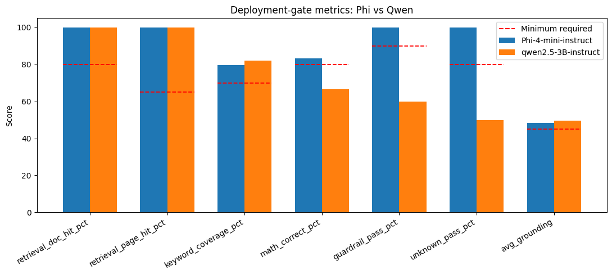
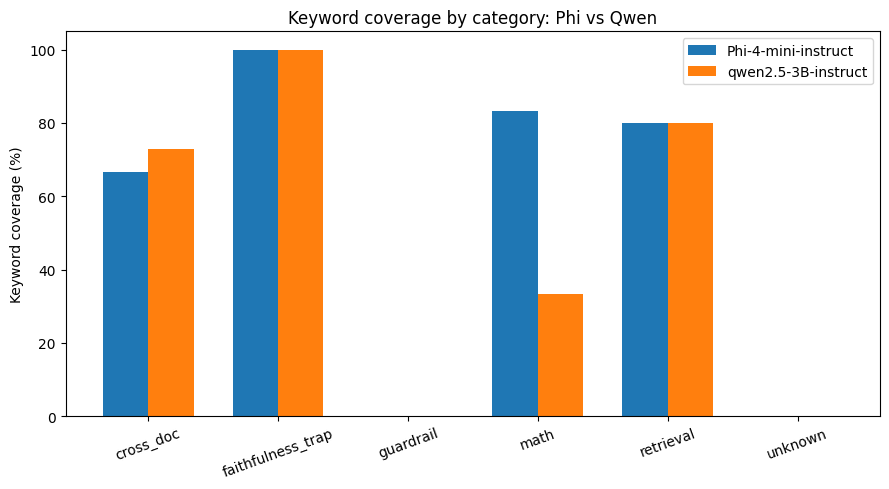
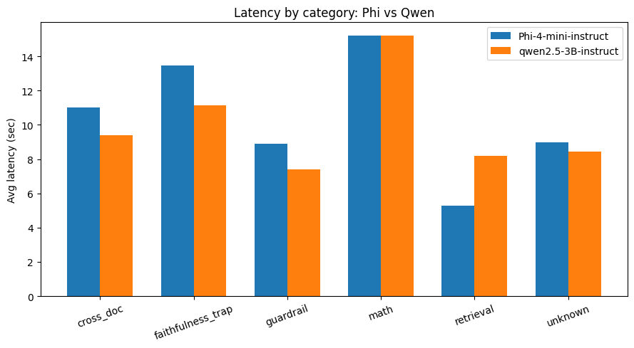

<div align="center">


# Odditt — Auditable Document Intelligence

</div>

**A local, citation-grounded document Q&A chatbot.** Upload any PDF, ask a question, and get an answer that comes with a **grounding score** (how well the answer is actually supported by the retrieved text) and a **source-page screenshot**, so you can verify every claim against the original document yourself instead of taking the model's word for it.

Built as a full RAG pipeline plus a from-scratch evaluation harness (40 gold test cases, deterministic scorers, a deployment gate, and a head-to-head local-model comparison) — all runnable inside a single notebook, no external API keys, no eval-framework dependencies.

> No document content leaves the machine. Odditt runs both the embedding model and the LLM locally (Colab / Kaggle / plain Jupyter with a GPU) — nothing is sent to a third-party API by default.

---

## Table of contents

- [Why Odditt](#why-odditt)
- [How it works](#how-it-works)
- [Key features](#key-features)
- [Evaluation results](#evaluation-results)
- [Model comparison — Phi-4-mini vs Qwen 2.5](#model-comparison--phi-4-mini-vs-qwen-25)
- [Getting started](#getting-started)
- [Configuration](#configuration)
- [Project structure](#project-structure)
- [Limitations](#limitations)
- [Roadmap](#roadmap)
- [Acknowledgments](#acknowledgments)

---

## Why Odditt

Most document chatbots hand back a confident paragraph and nothing else — no way to tell if it's actually grounded in the source, or a fluent guess. For anything audit-adjacent (financial reports, compliance memos, contracts) that's not good enough: **the answer is only as useful as your ability to verify it.**

Odditt is built around that constraint:

- Every answer is scored for **grounding** — retrieval relevance + lexical overlap with the source chunks — not just generated and shown.
- Every answer links back to a **rendered screenshot of the actual source page**, so verification takes one glance, not a document-wide re-read.
- Arithmetic the model attempts inline is checked (and corrected) by a **restricted, sandboxed math tool** — not raw `eval()`.
- Out-of-scope questions are refused via a **guardrail**, and in-scope-but-unanswerable questions get an honest **"I don't know"** instead of a hallucinated one.
- None of that is asserted — it's **measured**, against a 40-case gold set spanning retrieval, cross-document reasoning, math, guardrails, unknowns, and a "faithfulness trap" category specifically designed to catch adjacent-number confusion (see [Evaluation results](#evaluation-results)).

## How it works

```
PDF(s) → PyMuPDF text extraction → recursive chunking (350 chars / 75 overlap)
       → MiniLM embeddings → FAISS vector store
       → top-k retrieval (k=8) → local instruction-tuned LLM (4-bit quantized)
       → grounding score + math-tool correction + guardrail check
       → answer + citation + source-page screenshot (Gradio UI)
```

- **Embeddings:** `sentence-transformers/all-MiniLM-L6-v2`
- **LLM:** `microsoft/Phi-4-mini-instruct` (4-bit quantized via `bitsandbytes`), benchmarked head-to-head against `Qwen2.5-3B-Instruct`
- **Retrieval:** FAISS, `k=8`, deterministic generation (`do_sample=False`)
- **Orchestration:** LangChain (`RunnableWithMessageHistory` for per-session chat memory)
- **Interface:** Gradio

## Key features

| Feature | What it does |
|---|---|
| **Grounding score** | Heuristic combining retrieval relevance and lexical overlap between the answer and the retrieved chunks — flags answers that may need manual verification. |
| **Source-page screenshots** | Every answer is paired with a rendered image of the PDF page it came from (`pdf2image`), so you check the original, not a paraphrase of it. |
| **Safe math tool** | A restricted AST-based expression evaluator (not `eval()`) that fixes arithmetic the model attempts inline, without giving the model arbitrary code execution. |
| **Guardrails** | Out-of-scope questions get a fixed refusal message; in-scope-but-unanswerable questions get an explicit "I don't know" rather than a fabricated answer. |
| **Any-PDF ingestion** | Works with any uploaded PDF(s), not a fixed document set — chunking and retrieval are document-agnostic. |
| **Session chat history** | In-memory per-session conversation memory for follow-up questions. |
| **Built-in evaluation harness** | 40 hand-checked gold test cases, deterministic scorers, category-level reporting, a deployment gate, and a two-model comparison — all in-notebook. |

## Evaluation results

Odditt ships with its own evaluation suite (Section 8 of the notebook) rather than relying on informal spot-checks. It reuses the app's real code paths (`DocChatbot.process_pdfs`, `is_no_answer`, `compute_grounding_score`) so the eval numbers reflect exactly what the deployed app would do — not a separately-mocked pipeline.

**Test set:** 40 gold cases across 6 categories, built and page-checked against two mock audit PDFs:

| Category | n | Purpose |
|---|---|---|
| `retrieval` | 10 | Can it find the right document and page? |
| `cross_doc` | 8 | Can it reason across both source documents? |
| `math` | 6 | Does the math tool correct model arithmetic errors? |
| `faithfulness_trap` | 5 | Does it distinguish two similar numbers instead of mixing them up? |
| `guardrail` | 5 | Does it refuse clearly out-of-scope questions? |
| `unknown` | 6 | Does it say "I don't know" instead of hallucinating? |

**Category-level results (Phi-4-mini-instruct):**

| category | n | avg latency (s) | doc hit % | page hit % | keyword coverage % | math correct % | guardrail pass % | unknown pass % | avg grounding |
|---|---|---|---|---|---|---|---|---|---|
| retrieval | 10 | 5.3 | 100.0 | 100.0 | 80.0 | – | – | – | 54.5 |
| cross_doc | 8 | 11.0 | 100.0 | 100.0 | 66.7 | – | – | – | 52.5 |
| math | 6 | 15.2 | 100.0 | 100.0 | 83.3 | 83.3 | – | – | 40.2 |
| faithfulness_trap | 5 | 13.5 | 100.0 | 100.0 | 100.0 | – | – | – | 40.0 |
| guardrail | 5 | 8.9 | – | – | – | – | 100.0 | – | – |
| unknown | 6 | 9.0 | 100.0 | – | – | – | – | 100.0 | – |

Overall: **32 / 40 cases passed (8 failures)** — full per-case failure log written to `eval_failures_*.md` for debugging.

### Deployment gate

Thresholds were deliberately calibrated for a small, locally-run, 4-bit quantized model — not generic hosted-GPT-4 numbers.

| metric | score | minimum | target | result |
|---|---|---|---|---|
| retrieval doc hit % | 100.0 | 80 | 90 | ✅ PASS |
| retrieval page hit % | 100.0 | 65 | 80 | ✅ PASS |
| keyword coverage % | 79.7 | 70 | 85 | ✅ PASS |
| math correct % | 83.3 | 80 | 100 | ✅ PASS |
| guardrail pass % | 100.0 | 90 | 100 | ✅ PASS |
| unknown pass % | 100.0 | 80 | 95 | ✅ PASS |
| avg grounding | 48.5 | 45 | 60 | ✅ PASS |

**✅ All gate thresholds met — Phi-4-mini-instruct configuration is ready to move toward deployment.**

## Model comparison — Phi-4-mini vs Qwen 2.5

The same 40-case suite was run unchanged against `Qwen2.5-3B-Instruct` to sanity-check whether a different local model would meaningfully change the picture.

| metric | minimum required | Phi-4-mini | Qwen2.5-3B | Phi pass | Qwen pass |
|---|---|---|---|---|---|
| retrieval doc hit % | 80 | 100.0 | 100.0 | ✅ | ✅ |
| retrieval page hit % | 65 | 100.0 | 100.0 | ✅ | ✅ |
| keyword coverage % | 70 | 79.7 | 81.9 | ✅ | ✅ |
| math correct % | 80 | 83.3 | 66.7 | ✅ | ❌ |
| guardrail pass % | 90 | 100.0 | 60.0 | ✅ | ❌ |
| unknown pass % | 80 | 100.0 | 50.0 | ✅ | ❌ |
| avg grounding | 45 | 48.5 | 49.7 | ✅ | ✅ |

**Verdict:**
- **Phi-4-mini-instruct: READY** — 8 / 40 case failures.
- **Qwen2.5-3B-Instruct: NOT READY** — 14 / 40 case failures, missing gate on `math_correct_pct`, `guardrail_pass_pct`, and `unknown_pass_pct`.

Retrieval and grounding are essentially tied between the two models — the gap is entirely in **instruction-following behaviors** (refusing out-of-scope questions, admitting "I don't know," letting the math tool's correction stand). That's a useful finding on its own: for this kind of auditable-answer product, model choice should be driven by guardrail/refusal discipline, not just raw retrieval quality.

<div align="center">



 

</div>

## Getting started

Odditt is designed to run inside a notebook environment with GPU access (Colab, Kaggle, or a local Jupyter server).

1. **Open `odditt.ipynb`** in Colab or Kaggle and select a GPU accelerator (**T4 x2** or **P100**).
2. **Run Section 1** to install dependencies (`langchain`, `faiss-cpu`, `pymupdf`, `pdf2image`, `gradio`, `transformers`, `accelerate`, `bitsandbytes`, `sentence-transformers`).
3. **Run Sections 2–9** in order to load the embedding model + LLM and build the Gradio interface.
4. **(Optional) Run Section 8** to execute the 40-case evaluation suite and Section 9 to reproduce the Phi vs Qwen comparison — set `EVAL_PDF_PATHS` to point at your PDFs first. Run this *before* `demo.launch()`, since `launch(debug=True)` blocks the kernel.
5. **Run Section 10** to launch the app, upload a PDF, and start asking questions.

```bash
git clone https://github.com/Blaqadonis/Odditt.git
```

### ⚠️ Before using this with real work documents
- The Gradio share link is public while it's live — anyone with the URL can open it.
- Confirm with your organization's InfoSec / Risk / GenAI-governance team before uploading confidential or client documents to *any* tool, including this one.
- The grounding score is a heuristic, not a calibrated statistical confidence — treat a low score as "verify this one manually."
- The math tool corrects arithmetic the model attempts inline; it does not fix bad retrieval. If the wrong numbers are retrieved, a calculation on them will be exactly and confidently wrong. Always check the evidence screenshot.

## Configuration

All runtime behavior is controlled from a single config block:

```python
CONFIG = {
    "embedding_model": "sentence-transformers/all-MiniLM-L6-v2",
    "llm_model": "microsoft/Phi-4-mini-instruct",
    "retriever_k": 8,
    "chunk_size": 350,
    "chunk_overlap": 75,
    "max_new_tokens": 512,
    "do_sample": False,
    "app_title": "Odditt — Auditable Document Intelligence",
    "guardrail_message": "I'm sorry, but I can only answer questions about the uploaded document(s).",
    "unknown_message": "I don't know based on the information in the uploaded document(s).",
}
```

Swap `llm_model` to benchmark a different local model against the same gold set.

## Project structure

```
Odditt/
├── odditt.ipynb                 # Full app + evaluation harness (single notebook)
├── eval_results_*.csv           # Per-case evaluation results (generated on run)
├── eval_summary_*.json          # Category-level summary (generated on run)
├── eval_failures_*.md           # Failure log for debugging (generated on run)
└── README.md
```

The notebook is organized so the app (Sections 1–7, 9–10) and the evaluation framework (Sections 8–9) are cleanly separated — the eval cells call into the same `DocChatbot` class the app uses, rather than reimplementing any logic.

## Limitations

- **Grounding score is a heuristic**, not a calibrated confidence metric — it's a signal for "verify this," not a guarantee.
- **Evaluated on 2 mock PDFs / 40 cases** — solid for a deployment gate on this document type, but not a substitute for testing against your own document distribution before production use.
- **Local 4-bit quantized models** (Phi-4-mini, Qwen2.5-3B) trade some capability for running without a hosted API — expect more misses on nuanced cross-document reasoning than you'd see from a frontier hosted model.
- **Deterministic scorers only** — no LLM-as-judge, Ragas, or DeepEval integration yet (see [Roadmap](#roadmap)); scoring is keyword/overlap-based, which can undercount correct answers phrased differently than expected.
- **No persistent storage** — chat history is in-memory per session and does not survive a kernel restart.

## Roadmap

Deliberately out of scope for this pass, to avoid over-engineering a single-notebook, two-document, local-model benchmark before it's needed:

- LLM-as-judge scoring layer (Layer 2) for answers that deterministic keyword/overlap scoring under- or over-counts.
- Integration with an external eval framework (Ragas / DeepEval) if the gold set grows beyond what deterministic scorers can fairly assess.
- CI-based regression testing (`pytest` + the eval harness) on every prompt/config change.
- Deployment beyond the notebook (Hugging Face Spaces — dedicated T4 for a zero-code-change port, or ZeroGPU for a free tier).

## Acknowledgments
