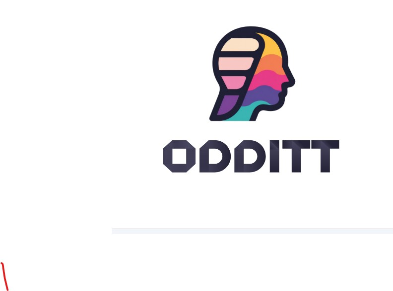

# Odditt — Auditable Document Intelligence
<p align="center">
  
</p>

<h1 align="center">🔎 Odditt</h1>

<p align="center">
AI-powered Audit Document Intelligence built with RAG, local LLMs, LangChain, Gradio, and FAISS.
</p>

A local, RAG-based document Q&A tool for audit/accounting documents, with a grounding score,
guardrails, and an evaluation framework used to gate deployment readiness.

> **Status:** repo scaffold in progress (Step 1 of the notebook-to-repo migration). Sections below
> will be filled in as each step lands -- see the migration checklist at the bottom.

## Structure

```
odditt/             Core RAG pipeline (config, retrieval, DocChatbot, tools) -- Step 2
evals/               Evaluation framework: gold questions, runner, scorers, deployment gate -- Step 3
  fixtures/          The two mock PDFs the gold question bank is written against
tests/               Fast, model-free unit tests for the eval scorers -- Step 4
.github/workflows/   CI: runs the Step 4 tests on every push/PR -- Step 5
```

## Requirements

- `requirements.txt` -- what the app itself needs (LLM pipeline, retrieval, UI).
- `requirements-dev.txt` -- adds what running/testing evals needs (pandas, matplotlib, pytest).
- System dependency: `poppler-utils` (for `pdf2image`) -- `apt-get install poppler-utils` on
  Debian/Ubuntu, `brew install poppler` on macOS. Not installable via pip.

## Running the model eval (not part of CI -- see note below)

CI does not run the actual LLM eval: GitHub's free runners have no GPU, and re-downloading
multi-GB model weights on every push isn't practical. The 40-question eval against a real model
(Phi, Qwen, etc.) is something you run locally or in Colab, same as the original notebook did --
CI only runs the fast, deterministic scorer tests (Step 4/5) on every push.

```bash
pip install -r requirements-dev.txt
python -m evals.run_evals --model microsoft/Phi-4-mini-instruct
```

(Command above is the target shape for Step 3 -- not wired up yet.)

## Migration checklist

- [x] Step 1 -- repo skeleton, requirements, .gitignore
- [x] Step 2 -- extract `odditt/` core pipeline from the notebook
- [ ] Step 3 -- extract `evals/` framework + `run_evals.py` CLI
- [ ] Step 4 -- unit tests for scorers
- [ ] Step 5 -- GitHub Actions workflow
- [ ] Step 6 -- finish README, usage docs
