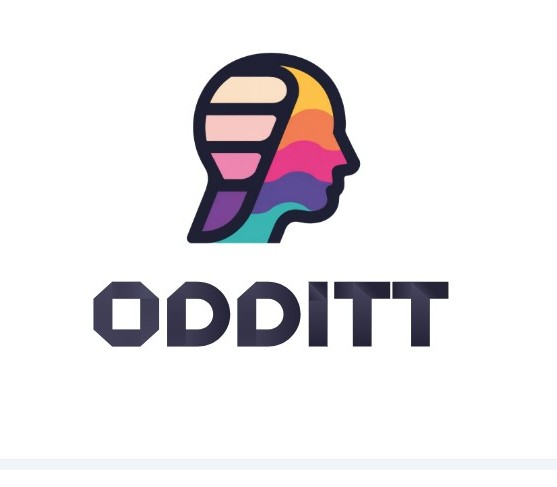

<p align="center">
  
</p>

<h1 align="center">🔎 Odditt</h1>
<p align="center">
Auditable Document Intelligence — built with RAG, local LLMs, LangChain, Gradio, and FAISS.
</p>

<p align="center">
  <a href="https://github.com/Blaqadonis/Odditt/actions/workflows/tests.yml">
    
  </a>
</p>

A local, RAG-based document Q&A tool for audit/accounting documents, with a grounding score,
guardrails, and an evaluation framework used to gate deployment readiness.

> **Status:** repo migration in progress -- see the checklist at the bottom for what's landed.

## Structure

```
odditt/             Core RAG pipeline (config, retrieval, DocChatbot, tools)
evals/               Evaluation framework: gold questions, runner, scorers, deployment gate
  fixtures/          The two mock PDFs the gold question bank is written against
tests/               Fast, model-free unit tests for the eval scorers
.github/workflows/   tests.yml -- runs tests/ on every push/PR (Python 3.11 & 3.12)
```

## Requirements

- `requirements.txt` -- what the app itself needs (LLM pipeline, retrieval, UI).
- `requirements-dev.txt` -- adds what running the real model eval needs (pandas, matplotlib, pytest).
- `requirements-test.txt` -- CI-only, pytest alone (see Tests section below for why this is separate).
- System dependency: `poppler-utils` (for `pdf2image`) -- `apt-get install poppler-utils` on
  Debian/Ubuntu, `brew install poppler` on macOS. Not installable via pip.

## Running the model eval (not part of CI -- see note below)

CI does not run the actual LLM eval: GitHub's free runners have no GPU, and re-downloading
multi-GB model weights on every push isn't practical. The 40-question eval against a real model
(Phi, Qwen, etc.) is something you run locally or in Colab, same as the original notebook did --
CI only runs the fast, deterministic scorer tests (see Tests, below) on every push.

```bash
pip install -r requirements-dev.txt
python -m evals.run_evals --model microsoft/Phi-4-mini-instruct
```

Writes eval_results/eval_summary/eval_failures files and exits non-zero if the deployment gate
fails (useful if a self-hosted GPU runner is ever wired into CI as a manually-triggered job).

## Tests

Fast, model-free unit tests for the eval scorers and gold-dataset integrity -- no GPU, no
downloads, no network. This is what the `Tests` badge above reflects, and what CI runs on every
push/PR against `main` (`.github/workflows/tests.yml`) across Python 3.11 and 3.12.

```bash
pip install -r requirements-test.txt   # pytest only -- see the file for why this is separate
                                        # from requirements-dev.txt
pytest tests/ -v
```

`requirements-test.txt` is deliberately minimal: `tests/` only imports `evals/scorers.py` and
`evals/eval_cases.py`, which only use the standard library. CI never imports `odditt.chatbot`, so
it never needs torch/transformers/langchain -- installs finish in seconds instead of minutes.

## Migration checklist

- [x] Step 1 -- repo skeleton, requirements, .gitignore
- [x] Step 2 -- extract `odditt/` core pipeline from the notebook
- [x] Step 3 -- extract `evals/` framework + `run_evals.py` CLI
- [x] Step 4 -- unit tests for scorers
- [x] Step 5 -- GitHub Actions workflow
- [ ] Step 6 -- finish README, usage docs
